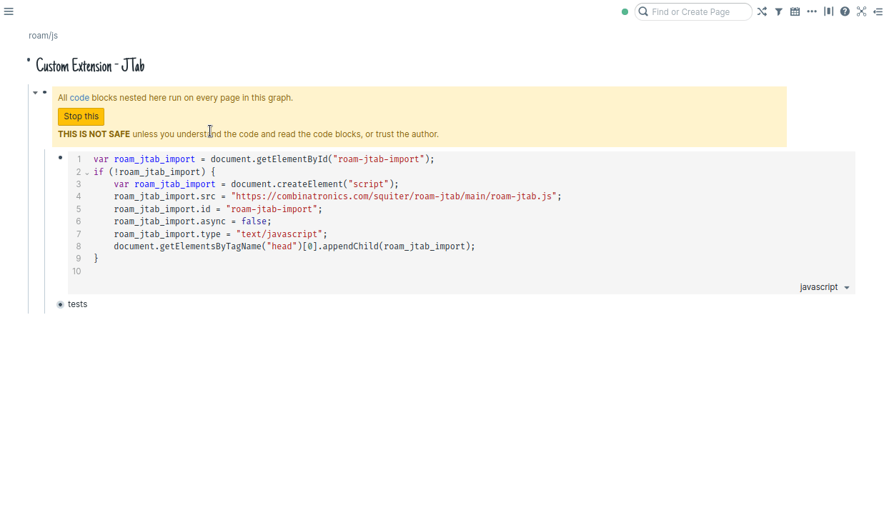

# Roam JTab Extension

This extension uses [JTab](https://jtab.tardate.com/index.htm) to render chords and tablatures into your RoamResearch graph.



## How to install

Go to your `roam/js` page, create a new block with the js component: `{{[[roam/js]])}}` and then add a Javascript code block as child of the component with this content:

```javascript
var roam_jtab_import = document.getElementById("roam-jtab-import");
if (!roam_jtab_import) {
    var roam_jtab_import = document.createElement("script");
    roam_jtab_import.src = "https://combinatronics.com/squiter/roam-jtab/main/roam-jtab.js";
    roam_jtab_import.id = "roam-jtab-import";
    roam_jtab_import.async = false;
    roam_jtab_import.type = "text/javascript";
    document.getElementsByTagName("head")[0].appendChild(roam_jtab_import);
}
```

Then refresh your graph

## How to use

To use this extension you should add your tablatures or chords using the [Jtab Notation](https://jtab.tardate.com/index.htm#notation) after one of those three tags: `#jtab`, `#jtab-chords-only` or `#jtab-tabs-only`. Since the music notation uses #, I recommend that you put your tabs and chords inside a code block to avoid creating new pages in your graph. E.g. "#jtab `C#m`"

If you're using [SmartBlocks](https://roamjs.com/extensions/smartblocks) I recommend use this template:

```
- #SmartBlock jtab
    - #jtab `<%CURSOR%>`
```

## Limitations

To make the images show, you need to click on a block and then leaving the edit. I couldn't figure out yet how to make this extension runs in every page load.
